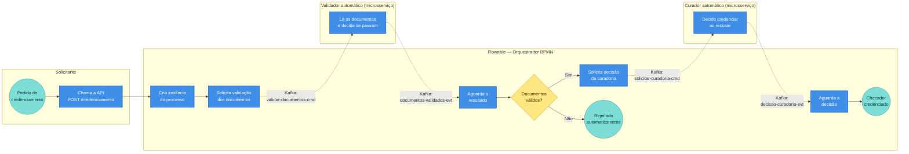

# Fluxo do Credenciamento de Checador (RF08)

Quem faz o quê, em raias. Caixas azuis são passos; losango amarelo é decisão; círculos verdes são início/fim. As setas pontilhadas com etiqueta `Kafka:` mostram onde o sistema troca mensagens via tópicos.

## Como ler o diagrama

1. **Solicitante** dispara o pedido na API.
2. **Flowable** cria o processo e, em vez de validar sozinho, **publica um comando no Kafka** pedindo a validação.
3. O **Validador automático** ouve esse tópico, avalia os documentos e **publica o resultado em outro tópico Kafka**.
4. O Flowable recebe o resultado e decide:
   - **Não** → encerra rejeitando.
   - **Sim** → publica um novo comando no Kafka pedindo a decisão da curadoria.
5. O **Curador automático** ouve esse tópico, decide `credenciar`/`recusar` e **publica a decisão em outro tópico Kafka**. O Flowable correlaciona pelo `checadorId` e finaliza o processo.

> O Flowable é quem mantém o estado do processo. O Kafka é o "correio" entre o Flowable e os microsserviços de validação e curadoria — nenhum dos dois conhece a URL do Flowable, ambos conhecem só seus tópicos. Atualmente o BPMN sempre converge para `endCredenciado` mesmo quando o curador `recusa`; a `decisaoFinal` fica gravada como variável do processo. Para diferenciar `credenciar` × `recusar` no `endActivityId`, basta adicionar um gateway depois do receive da curadoria.
