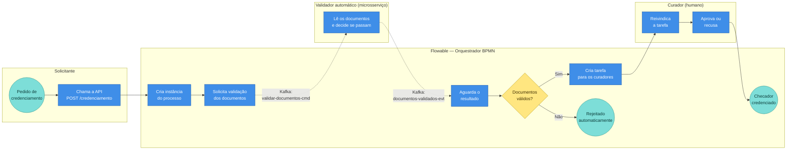

# Fluxo do Credenciamento de Checador (RF08)

Quem faz o quê, em raias. Caixas azuis são passos; losango amarelo é decisão; círculos verdes são início/fim. As setas pontilhadas com etiqueta `Kafka:` mostram onde o sistema troca mensagens via tópicos.

## Como ler o diagrama

1. **Solicitante** dispara o pedido na API.
2. **Flowable** cria o processo e, em vez de validar sozinho, **publica um comando no Kafka** pedindo a validação.
3. O **Validador automático** ouve esse tópico, avalia os documentos e **publica o resultado em outro tópico Kafka**.
4. O Flowable recebe o resultado e decide:
   - **Não** → encerra rejeitando.
   - **Sim** → cria uma tarefa humana para o **Curador**, que reivindica e aprova/recusa, fechando o processo.

> O Flowable é quem mantém o estado do processo. O Kafka é só o "correio" entre o Flowable e o serviço de validação. O curador conversa com o Flowable diretamente (sem Kafka).
